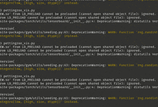

## Virtual Environment Setup

Following https://docs.conda.io/projects/conda/en/latest/user-guide/install/linux.html to install and set up conda. I set `auto_activate_base` to false so that it doesn't activate everytime I open my machine.
```
conda config --set auto_activate_base false
```

Then start setting up a test virtual environment
```
conda init
conda create -n marl-test python=3.9
conda activate marl-test
```

Good thing about using virtual environment is that you can keep different work that relies on different dependencies in separate environment. This would be helpful as project grows large.

Now I can start testing the many MARL environments.

## Gym

Simply install and test via:
```
pip install gym
python3 gym_test.py
```

## PettingZoo 

Simply install via:
```
pip install pettingzoo
```

I followed https://towardsdatascience.com/multi-agent-deep-reinforcement-learning-in-15-lines-of-code-using-pettingzoo-e0b963c0820b to replicate a simple game of Piston. To start, it first needs other libraries. This example also uses SuperSuit wrapper. 
```
pip install stable-baselines3[extra]
pip install SuperSuit
pip install pygame
pip install pymunk
```

Then we can train and save a basic PistonBall game (warnings can be ignored for now). This may take a while to run.
```
python3 piston_PPO_pettingzoo.py
```

We can watch the result (need GUI)
```
python3 pettingzoo_vis.py
```
A pygame renderer is needed to vizualize the trained models in the environment, but often the GUI fails to load. Just add these lines in the pettingzoo_vis.py file to avoid any errors
```
import pygame
from pygame.locals import *
pygame.init()
```

Author: Abhranil
